# Smart Bahrain Traffic Application

Professional project showcase repository for a final year project completed for Arab Open University, Bahrain.

This repository presents the system overview, documentation, diagrams, screenshots, demo media and source code for the Smart Bahrain Traffic Application. The project combines a citizen-facing mobile app, an admin dashboard and a backend API for reporting and reviewing traffic and parking violations.

## Project Overview

Smart Bahrain is a mobile-based traffic reporting system designed to help citizens report parking and traffic violations quickly and accurately. Users can submit incidents with location data and supporting media, while traffic authorities review the reports through a secure dashboard.

The system supports report tracking, notifications and a reward flow for verified reports. It aims to reduce congestion, improve road safety and make traffic reporting more transparent and efficient.

## Problem Statement

Traffic and parking violations such as double parking, blocking driveways and illegal stopping create congestion, delay emergency access and increase safety risks. In many cases, reporting is slow, fragmented or lacks enough evidence for follow-up.

The project addresses this problem by providing a single digital workflow that can:

- capture violations with GPS and multimedia evidence
- centralize report handling for traffic authorities
- preserve a clear record of report status and review actions
- encourage public participation through verified-report rewards

## Objectives

- Enable citizens to report traffic and parking violations digitally
- Capture incident location and supporting evidence
- Give authorities a secure dashboard to review and verify reports
- Track report progress from submission to final status
- Send notifications to keep users informed
- Support a reward flow for verified reports
- Improve accountability and reduce manual follow-up work

## Key Features

- Secure registration and login
- Role-aware access for users and administrators
- Report submission with location and media attachments
- Admin dashboard for reviewing, verifying and managing reports
- Report status tracking and history
- Rewards for verified submissions
- Notifications for important updates
- Emergency information and quick-access support
- Media upload support through the backend
- Separate mobile app, dashboard and API layers

## Technologies Used

| Category | Tools |
| --- | --- |
| Mobile App | React Native, TypeScript, Expo, Expo Router, NativeWind |
| Admin Dashboard | React, TypeScript, Vite, React Router, Recharts |
| Backend API | Node.js, Express, MongoDB, Mongoose |
| Authentication | JWT, bcryptjs |
| Media Handling | Multer, Cloudinary |
| Notifications / Messaging | Twilio |
| Location and Maps | `expo-location`, `react-native-maps` |
| Version Control | Git, GitHub |

## System Design

### Data Flow Diagram

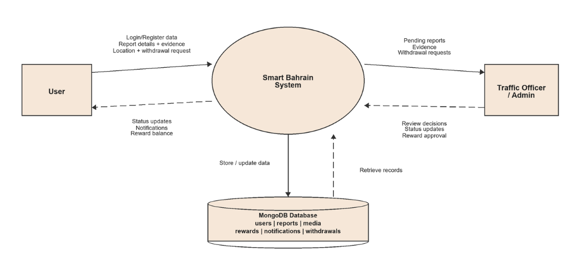

### Use Case Diagram

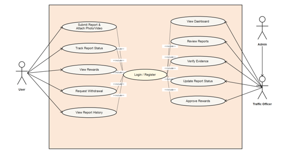

### Entity Relationship Diagram

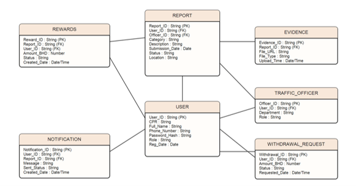

### Activity Diagram

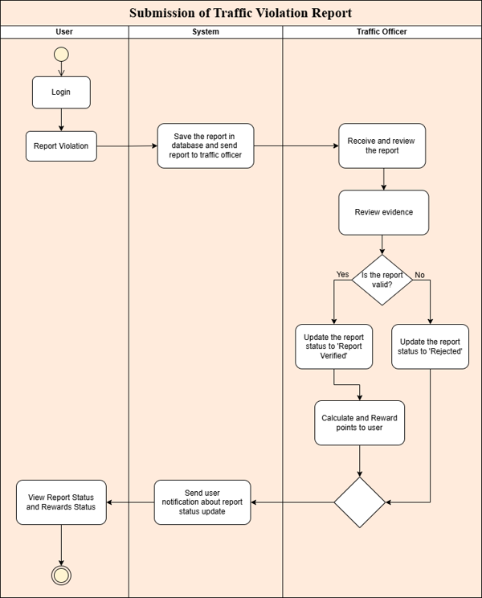

### Sequence Diagram

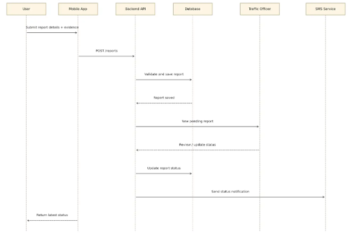

### State Diagram

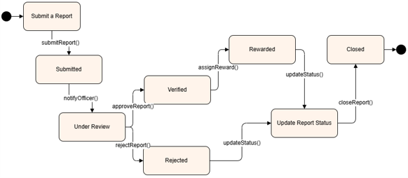

### Database Design Diagram

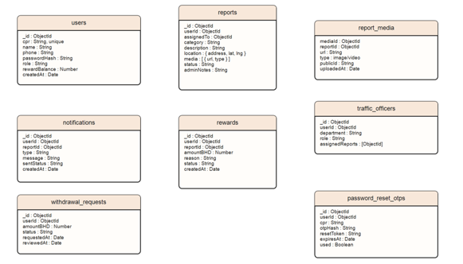

## Screenshots

The screenshots below highlight the main user and admin workflows.

Additional visual assets are available in the `screenshots/` folder.

### Login Page

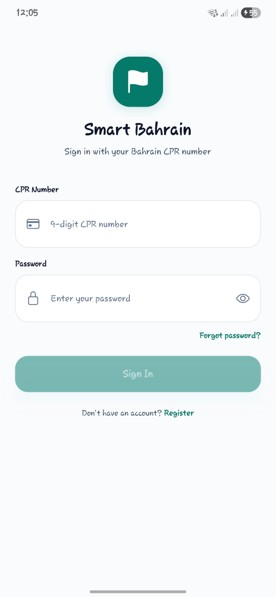

### Home Page

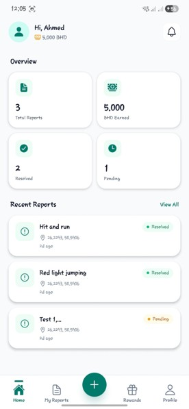

### Report Submission

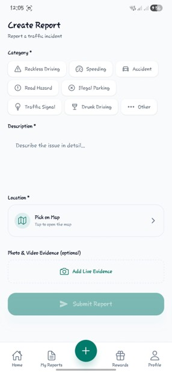

### Rewards Page

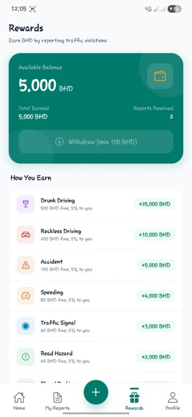

### Report History

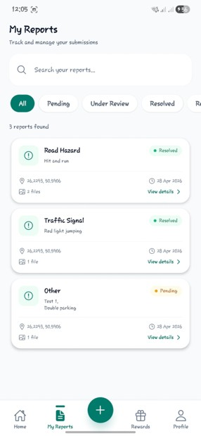

### Admin Dashboard

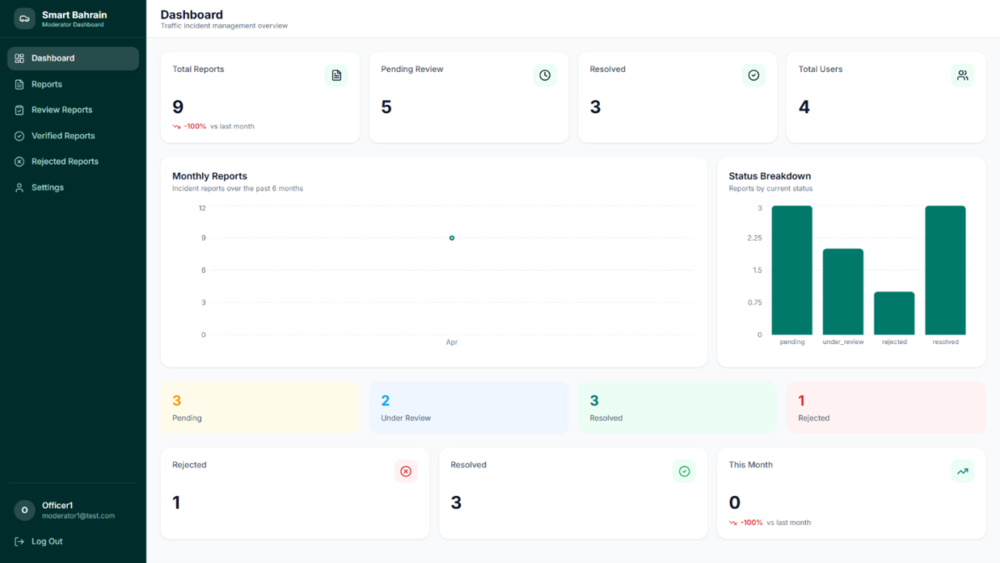

### Report Review

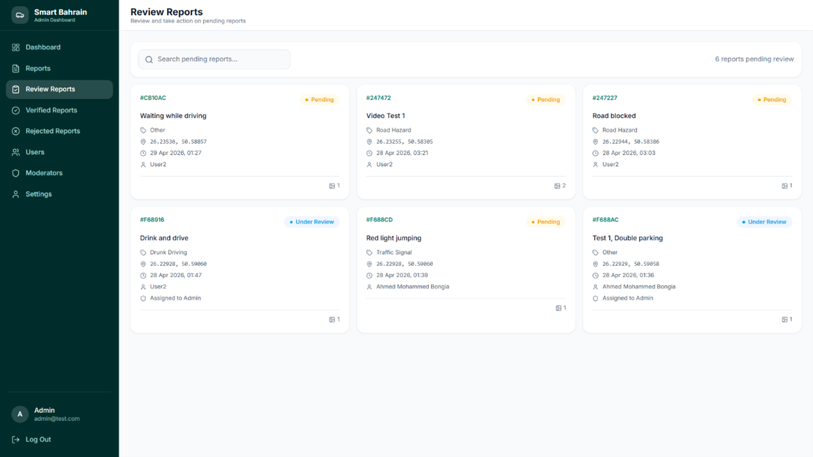

## Project Documentation

- [Project Poster (PNG)](./poster/Smart_Bahrain_Traffic_Poster.png)
- [Project Poster (PDF)](./poster/Smart_Bahrain_Traffic_Poster.pdf)
- [Presentation Part 1 (PDF)](./presentation/Smart_Bahrain_Traffic_Presentation_Part_1.pdf)
- [Presentation Part 2 (PDF)](./presentation/Smart_Bahrain_Traffic_Presentation_Part_2.pdf)
- [Demonstration Video](./videos/Smart_Bahrain_Traffic_Demo.mp4)
- [IT Club Certificate](./docs/showcase/IT_Club_Certificate.jpeg)

## Repository Structure

```text
.
├── docs/
│   ├── diagrams/
│   └── showcase/
├── poster/
├── presentation/
├── screenshots/
├── source-code/
└── videos/
```

## Source Code

The implementation is included in the `source-code/` folder.

- `source-code/smart-bahrain-traffic-application/backend` contains the Express + MongoDB API
- `source-code/smart-bahrain-traffic-application/frontend` contains the Expo mobile application
- `source-code/smart-bahrain-traffic-application/dashboard` contains the web-based admin dashboard

## Recognition & Showcases

This project was selected for presentation at:

- Arab Open University IT Club best projects showcase

### IT Club Recognition

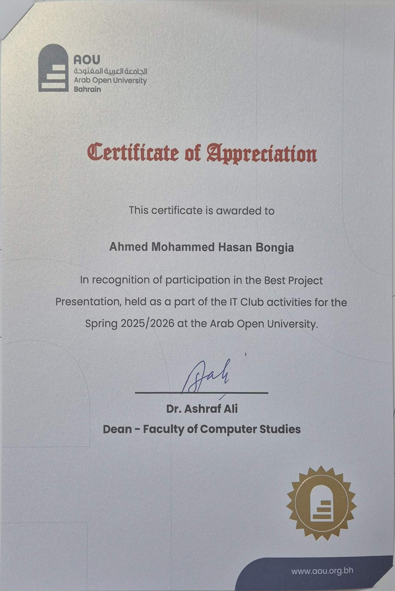

## Results & Benefits

Smart Bahrain improves the reporting experience for citizens and gives traffic authorities a clearer, faster and more structured workflow for handling violations.

The project provides:

- faster submission of reports with supporting evidence
- more organized review and verification by administrators
- better visibility into report status and history
- improved accountability through a central digital record
- a foundation for smarter traffic management and public participation

## Future Enhancements

- Push notifications for real-time report updates
- Offline-first report drafting and sync
- Map-based analytics and hotspot heatmaps
- Multi-language support
- Stronger moderation and fraud detection tools
- Expanded reporting and analytics for traffic trends

## Acknowledgements

I am grateful to my family, friends and classmates for their encouragement, and to Arab Open University, Bahrain, for the learning environment and support that made this work possible.


